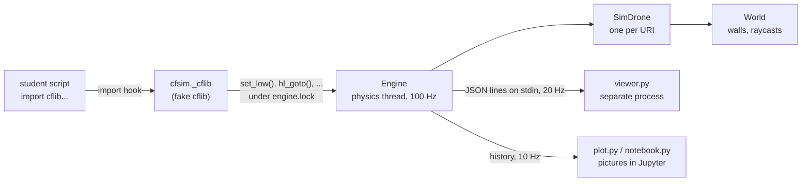
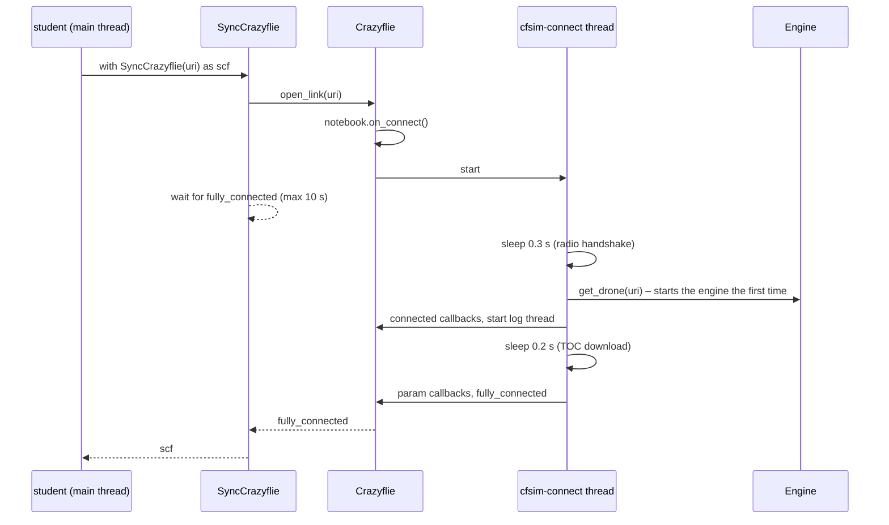

# Developer guide

How cfsim works inside, and how to change it. For using cfsim, see
[running scripts](running-scripts.md).

## Contents

1. [The idea](#1-the-idea)
2. [Repository layout](#2-repository-layout)
3. [How a script ends up in the simulator](#3-how-a-script-ends-up-in-the-simulator)
4. [Threads and processes](#4-threads-and-processes)
5. [The engine – `engine.py`](#5-the-engine--enginepy)
6. [The drone model – `drone.py`](#6-the-drone-model--dronepy)
7. [Worlds – `world.py`](#7-worlds--worldpy)
8. [The fake cflib – `_cflib/`](#8-the-fake-cflib--_cflib)
9. [The 3D window – `viewer.py`](#9-the-3d-window--viewerpy)
10. [Notebooks – `plot.py` and `notebook.py`](#10-notebooks--plotpy-and-notebookpy)
11. [How to …](#11-how-to-)
12. [Development setup and testing](#12-development-setup-and-testing)
13. [Making a release](#13-making-a-release)
14. [Design rules](#14-design-rules)

## 1. The idea

Students write ordinary scripts against Bitcraze's
[cflib](https://github.com/bitcraze/crazyflie-lib-python). cfsim provides its
own package with the **same module names, classes and methods** as cflib
(`cfsim/_cflib/`), but instead of talking to a radio, these classes talk to a
small physics simulation that runs in the same Python process.



Nothing in the student's script changes between the simulator and the real
drone. That is the most important rule of the project (see
[design rules](#14-design-rules)).

## 2. Repository layout

```
cfsim/                      repository root (pyproject.toml lives here)
├── cfsim/                  the Python package
│   ├── __init__.py         enable(), show(), replay(), reset(), the import hook
│   ├── __main__.py         python -m cfsim [options] script.py
│   ├── engine.py           Engine: configuration, physics thread, viewer pipe, history
│   ├── drone.py            SimDrone: models, controllers, estimator, sensors, battery
│   ├── world.py            World: text maps, raycasting, wall collisions
│   ├── viewer.py           the live 3D window (runs as its own process)
│   ├── plot.py             Scene drawing for notebooks: show(), replay()
│   ├── notebook.py         live picture below the running notebook cell
│   ├── worlds/*.txt        built-in worlds
│   └── _cflib/             the fake cflib (imported as "cflib")
│       ├── crtp/           init_drivers(), scan_interfaces()
│       ├── crazyflie/      Crazyflie, Commander, HighLevelCommander, Param,
│       │                   Supervisor, log (LogConfig), syncCrazyflie,
│       │                   syncLogger, swarm
│       ├── positioning/    motion_commander, position_hl_commander
│       └── utils/          multiranger, uri_helper
├── examples/               student examples 01–06 and notebook_demo.ipynb
├── docs/                   this documentation
├── pyproject.toml          package metadata; dev dependencies (Jupyter)
└── uv.lock                 locked dev environment
```

The only runtime dependency is matplotlib. Everything else is the standard
library.

## 3. How a script ends up in the simulator

### `cfsim.enable()` and the import hook

`enable()` (in `cfsim/__init__.py`) does three things:

1. Refuses to run if the **real** cflib is already imported
   (`sys.modules['cflib']` exists and has no `SIMULATED` attribute). Once a
   module is imported, Python would not import it again, so the student would
   silently fly the real drone.
2. Stores the options with `engine.configure(...)` and loads the world once to
   fail early on a bad world name.
3. Inserts `_CflibAliasFinder` at the front of `sys.meta_path`.

The finder handles every import whose name is `cflib` or starts with
`cflib.`. It maps the name to `cfsim._cflib...` and returns a spec whose loader
(`_CflibAliasLoader`) simply returns the real `cfsim._cflib...` module. So
`cflib.crazyflie` and `cfsim._cflib.crazyflie` are **the same module object**.
This matters for `isinstance()` checks such as
`isinstance(crazyflie, SyncCrazyflie)` in the commanders: it does not matter
which name a class was imported under.

If a module does not exist in `_cflib`, the finder raises an `ImportError` that
lists what *is* supported, instead of a confusing "No module named ...".

`cfsim._cflib.__init__` sets `SIMULATED = True`, which is how `enable()` tells
the fake cflib from the real one.

### `python -m cfsim script.py`

`__main__.py` parses the options with argparse, calls `cfsim.enable(...)`,
sets `sys.argv` to the script and its arguments, puts the script's folder on
`sys.path`, and runs it with `runpy.run_path(script, run_name='__main__')`.
The script therefore runs in the main thread of this process, exactly as with
`python script.py`.

### Lazy start

Nothing runs until the first drone connects. `Engine.get_drone(uri)` calls
`Engine.start()` the first time, which starts the physics thread and the viewer
process. That is why `cfsim.enable()` is cheap and why options can be changed
until the first connection (afterwards `configure()` prints a message and
ignores them).

## 4. Threads and processes

| Thread / process | Started by | Job |
| --- | --- | --- |
| main thread | Python | runs the student script |
| `cfsim-physics` | `Engine.start()` | steps all drones at 100 Hz, sends state to the viewer at 20 Hz, records history at 10 Hz |
| `cfsim-connect` | `Crazyflie.open_link()` | fakes the radio handshake (0.3 s), then the TOC download (0.2 s), then fires the connection callbacks |
| `cfsim-log` | `Log._start()` (one per Crazyflie) | calls the log callbacks of all started `LogConfig`s at their period |
| setpoint thread | `MotionCommander.take_off()` | sends hover setpoints every 0.2 s, like the real MotionCommander |
| Swarm workers | `Swarm.parallel_safe()` | one thread per drone, like the real Swarm |
| `cfsim-live` | `notebook.on_connect()` | redraws the live picture in notebooks every 0.3 s |
| viewer **process** | `Engine._start_viewer()` | the matplotlib window; reads JSON lines on stdin |

All threads are daemon threads, so they never keep the script alive.

### Locking

There is **one lock**: `Engine.lock` (an `RLock`). All drone state is read and
written while holding it:

- the physics thread holds it while stepping all drones;
- the fake cflib calls drone methods through `Crazyflie._do(fn, *args)`,
  which takes the lock;
- the log thread holds it while reading all variables of a batch, then
  **releases it before** calling the student's callbacks (callbacks may call
  back into cfsim);
- `plot.snapshot()` copies the state under the lock and draws without it.

Rule of thumb: take the lock to read or change drone state, never call
student code or slow drawing code while holding it.

## 5. The engine – `engine.py`

### Configuration

`_config` is a module-level dict with the defaults (`world`, `model`,
`models`, `positioning`, `noise`, `decks`, `viewer`, `battery_drain`,
`start_positions`, `quiet`, `inline`). `configure(**options)` validates and
updates it. `get_engine()` creates the single `Engine` from a copy of
`_config` the first time it is called.

### Placing drones

`get_drone(uri)` creates a `SimDrone` the first time a URI is seen.
`_start_position()` uses, in order: `start_positions[uri]`, the next free
start spot of the world (`S`, `1`…`9`), or a spiral search around the first
start spot for a free place.

### The physics loop

`_run()` keeps a fixed time step of 1/100 s on the wall clock. If the process
falls behind (for example while the notebook draws a picture), it runs up to 10
steps in a row to catch up and then skips ahead, so the simulation stays in
real time instead of slowing down. Each step:

1. `drone.step(dt, now)` for every drone (see the next section);
2. `_drone_collisions()`: drones closer than the sum of their radii crash;
3. every 1/20 s: `_send_state()` to the viewer;
4. every 1/10 s: `_record()` for `cfsim.replay()`.

### Talking to the viewer

The engine writes one JSON object per line to the viewer's stdin:

| `type` | Content | When |
| --- | --- | --- |
| `world` | `World.to_dict()` | once, at start |
| `state` | time, `state_for_viewer()` of every drone; every 4th message also the last 600 trail points | 20 Hz |
| `msg` | a `[cfsim]` message (the window shows the last three) | on `Engine.message()` |
| `end` | – | at exit |

If writing fails (the window was closed), `_viewer` is set to `None` and the
simulation continues without it. At exit (`atexit`), `_final_state()` waits up
to 1.5 s for falling drones to land, sends the last state and `end`, and closes
the pipe. The viewer process is not a daemon, so the window stays open after
the script has ended.

### History

`_record()` stores `(t, ((uri, x, y, z, yaw, crashed), ...))` at 10 Hz in
`Engine.history`, skipping samples where nothing changed, and
`history_info[uri] = (label, color, model)`. At most `HISTORY_MAX` samples (an
hour of flying) are kept. `cfsim.reset()` clears drones and history.

## 6. The drone model – `drone.py`

`SimDrone` is deliberately simple: a point mass that follows velocity commands
with a first-order delay. It does not simulate propellers or attitude control.
It keeps the behaviour that matters when programming a real Crazyflie.

### Models

`MODELS` holds the parameters of the `2.1+` and `brushless` models: maximum
speeds and acceleration, the time constant `tau`, flight time, hover thrust,
whether arming is required, and the radius used for collisions.
`MODEL_ALIASES` accepts spellings such as `'cf21bl'`.

### State

Position `pos`, velocity `vel` (world frame, m and m/s), `yaw` in degrees (0 =
+x), `roll`/`pitch` (only for logging and display), `motors`, `on_ground`,
`crashed`, `armed`, `thrust_locked`, battery use, and the estimator error.

### Command modes

| `mode` | Set by | Meaning |
| --- | --- | --- |
| `off` | start, stop, crash | motors off |
| `low` | `Commander.send_*_setpoint()` → `set_low(kind, values)` | follow the last low-level setpoint |
| `hl` | `HighLevelCommander.takeoff/go_to/land` → `hl_goto()` | follow a smooth trajectory, then hold |

`_controller()` turns the active command into a desired velocity (or, for
attitude setpoints, an acceleration):

- **High-level**: the target moves along a smoothstep from start to goal in
  `duration` seconds; a P controller on the *estimated* position plus a
  feed-forward velocity follows it. When the trajectory ends, the goal is held
  (`hl_hold`). Landing below 6 cm switches the motors off.
- **Low-level**: `hover` (body velocities + height), `velocity` (world
  velocities), `position`, `zdistance` (roll/pitch + height) and `attitude`
  (roll/pitch/yaw rate/thrust). `send_notify_setpoint_stop()` hands over to the
  high-level commander, which holds the current position.

### Rules copied from the firmware

- **Commander watchdog**: a low-level setpoint older than 0.5 s is replaced by
  "stop moving"; after 2 s the motors stop and the drone falls.
- **Thrust lock**: `send_setpoint()` is ignored until one setpoint with thrust 0
  has been sent.
- **Arming**: the brushless model ignores flight commands until
  `supervisor.send_arming_request(True)`.
- **Crashes**: into a wall, the ceiling, another drone, or a landing faster than
  3.5 m/s. A crashed drone ignores commands until
  `send_crash_recovery_request()` on the ground.
- **Battery**: drains while flying (`battery_drain` speeds it up); at empty
  the motors stop. `vbat()` sags 0.15 V under load.

Messages to the student go through `say(msg, once_key)`, which prints each
kind of warning only once.

### Physics step

`step(dt, now)`: controller → acceleration limited by `acc_max` (or gravity
when the motors are off, with some drag) → velocity limited by `vmax_xy` and
`vmax_z` → yaw → roll/pitch from the horizontal acceleration → position →
ground contact (hard-landing check) → estimator → battery → wall/ceiling
collisions → append to `trail` when the drone moved more than 3 cm.

### Estimator (what the drone *thinks* its position is)

`est_pos()` = true position − `est_origin` + `est_err`.

- `flow`: the origin is the take-off spot (reset by `kalman.resetEstimation`,
  which `MotionCommander` does at take-off), and the error does a random walk
  that grows with speed – the drift of a real Flow deck.
- `lighthouse`: origin (0, 0) = the world's `S`; small noise without drift.
- `none`, or `flow` without the Flow deck: large drift while flying.

All controllers use `est_pos()`, so drift makes the drone really end up
somewhere else – as on the real drone.

### Sensors

`ranges()` raycasts front/left/back/right from the drone in the horizontal
plane against walls and other drones at about the same height, and computes up
(to the ceiling) and down (`zrange`, the height). Values are in metres, `None`
beyond 4 m, with distance-dependent noise. The result is cached for 30 ms
because several log variables ask for it in the same batch. The log layer
turns metres into millimetres, and "out of range" into 32766, like the
firmware.

`rssi()` is a log-distance model to the world's beacon, for return-home
exercises.

## 7. Worlds – `world.py`

`World.from_text()` parses the map format (see the README). Each `#` cell
becomes an axis-aligned box. Runs of `#` in a row are merged into one box,
then boxes with the same x-range in neighbouring rows are merged, so a wall is
a few large boxes instead of many cells. That keeps raycasting fast.

- Coordinates: the centre of the `S` cell is (0, 0); +x is right on the map,
  +y is up on the map. `bounds` is the outline used for drawing.
- `raycast(x, y, dx, dy, max_range, circles)`: slab test against every box,
  plus ray–circle tests for other drones. Returns the distance or `None`.
- `hits_wall(x, y, radius)`: circle–box test for collisions.
- `World.load('open')` is a special world without walls or ceiling
  (`bounded=False`).

## 8. The fake cflib – `_cflib/`

Every module copies the public interface of the matching cflib module, with
the same names and argument lists, so student code does not notice the
difference. Methods that cannot be simulated raise `NotImplementedError` with
a clear message rather than silently doing nothing.

| Module | What it does |
| --- | --- |
| `crtp` | `init_drivers()` does nothing; `scan_interfaces()` lists the simulated drones |
| `crazyflie.Crazyflie` | connection state machine and callbacks (`connected`, `fully_connected`, `disconnected`, …); owns the subsystems below |
| `crazyflie.Commander` | low-level setpoints → `SimDrone.set_low()` |
| `crazyflie.HighLevelCommander` | `takeoff/go_to/land/stop` → `SimDrone.hl_*()` |
| `crazyflie.Param` | a small set of known parameters (deck flags, `kalman.resetEstimation`, …); unknown parameters are accepted with a note so real-drone scripts still run |
| `crazyflie.Supervisor` | arming, crash recovery, emergency stop, status queries |
| `crazyflie.log` | `LOG_TOC` (name → type, getter, required deck), `LogConfig`, the 26-byte limit, the log thread |
| `crazyflie.syncCrazyflie` | `SyncCrazyflie`: `open_link()` waits for `fully_connected` (10 s timeout) |
| `crazyflie.syncLogger` | `SyncLogger`: a queue fed by the log callbacks |
| `crazyflie.swarm` | `Swarm`, `CachedCfFactory`: places drones in URI order, runs functions in parallel threads |
| `positioning.motion_commander` | a copy of the real MotionCommander logic (hover setpoints from a thread) |
| `positioning.position_hl_commander` | the real PositionHlCommander logic on top of the high-level commander |
| `utils.multiranger` | the real Multiranger logic on top of a `LogConfig` |
| `utils.uri_helper` | `uri_from_env()`, `address_from_env()` |

The commanders in `positioning/` and `utils/` are written on top of the public
`Crazyflie` API, exactly like the real ones. That way their timing and their
quirks (for example how `MotionCommander` computes heights) match the real
library.

### The connection sequence



### Logging

`Log.add_config()` checks each variable against `LOG_TOC` (and that the
required deck is mounted), adds up the sizes from `TYPE_SIZE`, and rejects
blocks larger than 26 bytes or with a period outside 10–2550 ms – the same
errors the real drone gives. The log thread wakes every 4 ms, collects all
blocks that are due, reads the values under the engine lock, and then calls
the callbacks without the lock. Timestamps are milliseconds since the drone
"booted".

## 9. The 3D window – `viewer.py`

The window runs in a **separate process** (`python -m cfsim.viewer`), because:

- GUI toolkits want the main thread, and the main thread belongs to the
  student's script;
- the window can stay open after the script has ended;
- a missing or broken GUI toolkit cannot break the simulation.

The engine passes its own package folder on `PYTHONPATH` and removes
`MPLBACKEND` (Jupyter sets an inline backend, but the viewer needs a window).

`_pick_backend()` keeps the default backend if it can open windows, and
otherwise tries `macosx`, `TkAgg`, `QtAgg`, `Qt5Agg`, `GTK3Agg`, `WXAgg`. If
nothing works (or there is no display on Linux), `_no_window()` prints the
reason and a fix and exits with **code 3**. The engine watches for that code
and stops sending.

A reader thread parses the JSON lines into `_state`; a matplotlib
`FuncAnimation` redraws from `_state` every 60 ms.

- `python -m cfsim.viewer --check` opens a test window on its own.
- `CFSIM_SNAPSHOT=out.png` (with `CFSIM_SNAPSHOT_AFTER=8`) uses the `Agg`
  backend and saves a PNG after that many seconds instead of opening a window.
  Useful for testing without a screen.

## 10. Notebooks – `plot.py` and `notebook.py`

`plot.Scene` draws the world (walls as 3D faces and top-view rectangles, the
beacon) once, and creates the artists for each drone (trail, position dot,
heading line) the first time the drone appears. `Scene.update(t, drones)` only
moves those artists, which keeps redrawing cheap. `plot.snapshot(engine)`
copies the current state in the form `update()` expects.

Three users of `Scene`:

- **`cfsim.show()`** – one picture with pyplot, so Jupyter shows it below the
  cell.
- **`cfsim.replay()`** – builds frames from `Engine.history`. Pauses longer than
  0.25 s between samples are shortened, so a notebook that sat idle between two
  cells does not replay minutes of nothing. The frames are rendered as JPEG
  (quality 70) with matplotlib's `HTMLWriter` into a self-contained JavaScript
  player; that is about a third of the size of `to_jshtml()`'s PNG frames.
  More than `max_frames` frames speeds the replay up.
- **The live picture** (`notebook.py`) – `on_connect()` is called from
  `Crazyflie.open_link()`. If we are in a Jupyter kernel, `inline` is on, and
  this cell has no picture yet (`execution_count`), it shows a PNG with
  `display(..., display_id=True)` and remembers the handle. The `cfsim-live`
  thread redraws every 0.3 s while something moves, and replaces the picture
  with `handle.update(...)`.

  The update must be attributed to the cell that is running. ipykernel 7 keeps
  the "current cell" in a context variable, which a plain thread does not
  inherit, so `on_connect()` saves `contextvars.copy_context()` and the
  thread sends each update inside it (`ctx.run(handle.update, img)`).

Figures for replay and the live picture are created with
`matplotlib.figure.Figure` (not pyplot): pyplot would show them by itself in
the notebook, and pyplot is not safe to use from a background thread.

## 11. How to …

### … add a log variable

Add a line to `LOG_TOC` in `_cflib/crazyflie/log.py`:

```python
'motor.m1': ('uint16_t', lambda d: 30000 if d.motors else 0, None),
```

The tuple is (type as in the real TOC, getter that receives the `SimDrone`,
required deck or `None`). Use the real firmware's name and type, so that the
26-byte limit is computed correctly. Add it to the variable list in the README.

### … add a cflib function

Find the real signature in cflib and copy it, including defaults. Implement it
in the matching `_cflib` class. If it changes the drone, add a method on
`SimDrone` and call it through `self._cf._do(...)` so it runs under the lock.
If it cannot be simulated, raise `NotImplementedError('... is not simulated in
cfsim')`.

### … add a new cflib module

Create the file under `_cflib/` with the same path as in cflib (for example
`_cflib/utils/power_switch.py` for `cflib.utils.power_switch`). The import hook
finds it automatically. Update the "Supported:" list in the `ImportError`
message in `cfsim/__init__.py`.

### … add a built-in world

Put a `.txt` file in `cfsim/worlds/`. It is listed by `--list-worlds`
automatically, and `pyproject.toml` includes `worlds/*.txt` in the package.
Add it to the worlds table in the README.

### … add a drone model

Add an entry to `MODELS` in `drone.py` (copy an existing one), and a short
alias in `MODEL_ALIASES` if useful. Update the `--model` help text in
`__main__.py`, the `enable()` docstring, and the README.

### … add an option

1. Add the key and default to `_config` in `engine.py`.
2. Add the parameter to `enable()` in `__init__.py` (and its docstring), and
   pass it on to `engine.configure()`.
3. If it makes sense on the command line, add it to the argparse setup in
   `__main__.py`.
4. Read it where needed (`self.cfg[...]` in the engine, or `_config` before
   the engine exists).
5. Add it to the options table in the README.

## 12. Development setup and testing

```
git clone https://github.com/clbokea/cfsim.git
cd cfsim
uv sync                      # .venv with cfsim (editable) + Jupyter
```

`uv sync` installs the package in editable mode, so changes in `cfsim/` are
used immediately (restart a running notebook kernel).

There is no automated test suite yet. Before a release, check by hand:

```
# every example runs without a window and without noise
for f in examples/0*.py; do
    uv run python -m cfsim --no-viewer --no-noise --world arena "$f" || echo "FAILED: $f"
done

# the window opens
uv run python -m cfsim.viewer --check
uv run python -m cfsim examples/01_hello_fly.py

# the notebook runs from top to bottom (the 3D window opens too; the
# 20 s wall-following cell makes this take about a minute)
uv run jupyter nbconvert --to notebook --execute examples/notebook_demo.ipynb \
    --output /tmp/notebook_out.ipynb
```

Without a screen (CI, SSH), use `--no-viewer` or `CFSIM_SNAPSHOT=out.png` to
get a picture of the final state.

Keep the examples and the notebook free of outputs when committing
(*Edit → Clear Outputs of All Cells* in JupyterLab).

## 13. Making a release

Releases are GitHub releases with a zip and a wheel attached, so students can
`pip install` a URL or a downloaded zip.

1. Set the new version in **three places**:
   - `pyproject.toml` (`version = "x.y.z"`)
   - `cfsim/__init__.py` (`__version__`)
   - the install links in `README.md` and `docs/running-scripts.md`
     (search for the old version)
2. Run `uv lock`, test (see above), commit, and tag:

   ```
   git commit -am "cfsim x.y.z: ..."
   git tag -a vx.y.z -m "cfsim x.y.z"
   git push && git push origin vx.y.z
   ```

3. Build the release files. The zip has a single `cfsim/` folder inside, like
   all earlier releases, so `pip install cfsim-x.y.z.zip` works:

   ```
   mkdir -p dist
   git archive --prefix=cfsim/ -o dist/cfsim-x.y.z.zip vx.y.z \
       LICENSE README.md pyproject.toml cfsim examples docs
   uv build --wheel             # dist/cfsim-x.y.z-py3-none-any.whl
   ```

4. Create the release:

   ```
   gh release create vx.y.z dist/cfsim-x.y.z.zip dist/cfsim-x.y.z-py3-none-any.whl \
       --title "cfsim x.y.z" --notes "What changed, and how to install"
   ```

5. Check it: `uv run --no-project --with <release zip URL> python -m cfsim --list-worlds`.

Versioning: the patch number (1.0.**x**) for fixes and documentation, the minor
number (1.**x**.0) for new features.

## 14. Design rules

1. **The same script flies the simulator and the real drone.** Never add
   simulator-only arguments to cflib functions. Simulator settings belong in
   `cfsim.enable()` or on the command line.
2. **Behave like the real drone where students make mistakes**: watchdog,
   thrust lock, arming, log limits, crashes, drift. A simulator that forgives
   everything teaches the wrong lessons.
3. **Explain, do not just fail.** When the drone ignores a command, print a
   `[cfsim]` message that says why and what to do (once).
4. **Simple physics on purpose.** cfsim is for programming flight behaviour,
   sensing and swarms – not for tuning controllers.
5. **Few dependencies, every platform.** Only matplotlib at runtime; no
   compiled code, no Docker, no GPU. It must work on school laptops with
   Windows, macOS and Linux.
6. **Never break the flight for a picture.** Viewer, live picture and replay
   must fail quietly and let the simulation continue.
